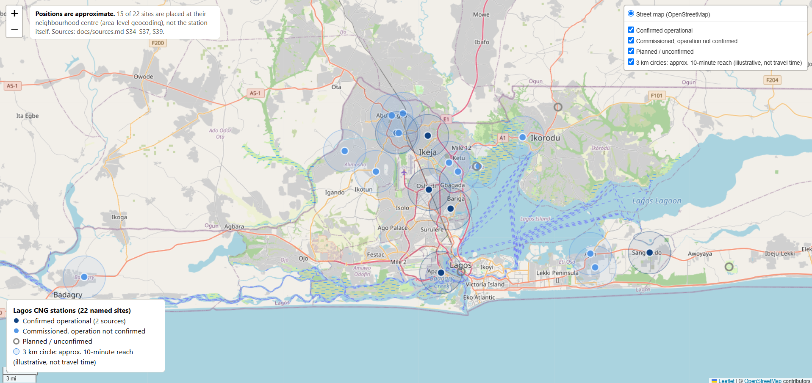

# Stuck in the Queue: Why Lagos Drivers Are Slow to Switch to CNG

A policy analysis of when converting a Lagos commercial vehicle from petrol to compressed natural gas (CNG) pays off for the driver, and which policies would make it pay more often.

Malik Badmus | October 2026

- Policy brief: [Markdown](reports/policy_brief.md) · [PDF](reports/policy_brief.pdf)
- Working paper: [Markdown](reports/working_paper.md) · [PDF](reports/working_paper.pdf)

## Key findings

- CNG is 61–86% cheaper than petrol per kilometre, but the time drivers lose queuing for gas decides whether conversion pays.
- With daily queuing held to one hour, conversion pays in 98% of simulated cases. At four hours it pays in 16%.
- Of 22 named CNG sites in Lagos, only 6 are confirmed operational, and 10 of 12 surveyed petrol drivers cite the lack of a nearby station.




[Open the interactive station map](https://malikbadmus79-max.github.io/nigeria-cng-policy/outputs/figures/lagos_station_map.html)

## Recommendations

1. Raise capacity at the busiest existing stations so that drivers queue no more than about an hour a day (station operators, with Pi-CNG & EV and MDGIF).
2. Add refuelling points in areas with no confirmed site, starting by confirming whether the 11 commissioned IBILE stations are selling gas (Pi-CNG & EV, Lagos State through IBILE, NMDPRA).
3. Link any expansion of free conversion to station capacity (Pi-CNG & EV).

## Interactive charts

Served through GitHub Pages:

- [Lagos CNG station map](https://malikbadmus79-max.github.io/nigeria-cng-policy/outputs/figures/lagos_station_map.html) (notebook 05)
- [Petrol vs CNG prices](https://malikbadmus79-max.github.io/nigeria-cng-policy/outputs/figures/petrol_vs_cng.html) (notebook 01)
- [Break-even queue time by earnings](https://malikbadmus79-max.github.io/nigeria-cng-policy/outputs/figures/break_even_queue.html) (notebook 02)
- [Surveyed drivers: actual vs break-even queue time](https://malikbadmus79-max.github.io/nigeria-cng-policy/outputs/figures/survey_break_even.html) (notebook 03)
- [Barriers cited by petrol drivers](https://malikbadmus79-max.github.io/nigeria-cng-policy/outputs/figures/barriers.html) (notebook 04)
- [Monte Carlo distribution of net benefit](https://malikbadmus79-max.github.io/nigeria-cng-policy/outputs/figures/monte_carlo_net_benefit.html) (notebook 06)
- [Sensitivity of net benefit to each input](https://malikbadmus79-max.github.io/nigeria-cng-policy/outputs/figures/monte_carlo_sensitivity.html) (notebook 06)
- [Policy options: simulated impact](https://malikbadmus79-max.github.io/nigeria-cng-policy/outputs/figures/policy_options_impact.html) (notebook 07)

## Methods

- A desk review of 44 published sources gives prices, conversion costs, loan terms and station lists ([docs/sources.md](docs/sources.md)).
- A survey of 25 Lagos commercial drivers gives earnings, fuel spend and queue times ([docs/survey_method.md](docs/survey_method.md)).
- A daily cost model compares fuel saving with earnings lost in queues and loan repayments, first in fixed scenarios and then in a 10,000-draw Monte Carlo simulation.
- The 22 named Lagos CNG sites are mapped by status.
- Five policy options are appraised on simulated impact, cost, speed, feasibility and evidence.

## Repository structure

```
data/
  raw/          source data compiled from published sources (model inputs, prices, station lists)
  processed/    cleaned survey data and geocoded stations
docs/           source log, data conflicts, model inputs, survey method, policy scores, reading notes
notebooks/      analysis notebooks 01-07, run in order
outputs/
  figures/      interactive HTML charts and the station map
  figures/png/  static PNG versions of the main charts
reports/        working paper and policy brief (Markdown and PDF)
src/            cost model, survey cleaning, geocoding, simulation, policy options, chart and PDF export
tests/          tests for the code in src/ (pytest)
```

## How to reproduce

```
git clone https://github.com/malikbadmus79-max/nigeria-cng-policy.git
cd nigeria-cng-policy
python -m venv .venv
.venv\Scripts\activate          # Windows
source .venv/bin/activate       # macOS / Linux
pip install -r requirements.txt
python -m pytest
```

Then run `notebooks/01_petrol_prices.ipynb` to `notebooks/07_policy_options.ipynb` in order.

The raw survey export (`data/raw/survey_responses.csv`) is not published, because it contains submission timestamps. `src/clean_survey.py` needs that file and cannot be run without it. The cleaned, anonymised output, `data/processed/survey_clean.csv`, is included, and every notebook reads that file instead. `src/geocode_stations.py` needs an internet connection; its output, `data/processed/lagos_cng_stations_geocoded.csv`, is also included.

## Limitations

- The survey covers 25 drivers recruited in person at CNG stations and car parks. It is small and non-random, so results describe these drivers rather than all Lagos drivers.
- Earnings are reported before owner remittance or app commission, and pre-conversion petrol spend is recalled, so savings and queue costs may be overstated.
- Station positions are approximate, and the policy scores other than impact are judgements. The options were modelled one at a time.

## License

Code is released under the MIT License ([LICENSE](LICENSE)). Reports, documentation and data are released under [Creative Commons Attribution 4.0 International (CC BY 4.0)](https://creativecommons.org/licenses/by/4.0/).

## Contact

- Malik Badmus
- LinkedIn: add link
