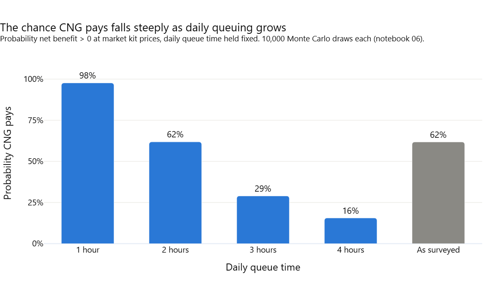
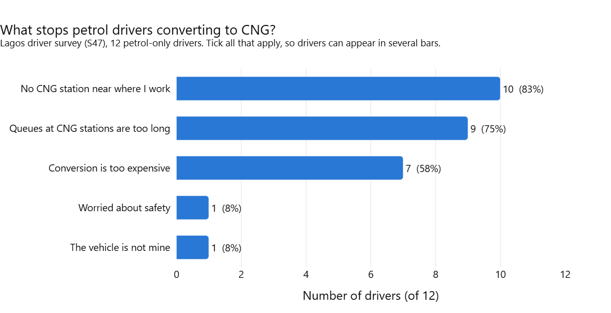
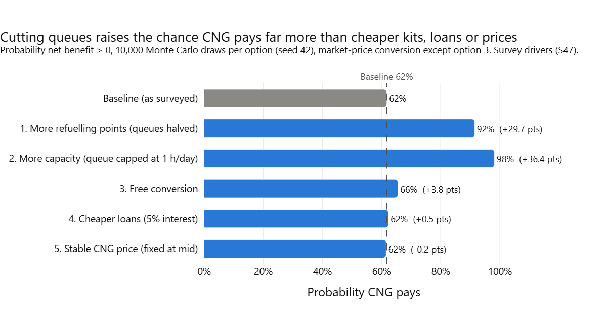

# Shorter Queues, Not Cheaper Kits: Making CNG Pay for Lagos Commercial Drivers

Policy brief | Malik Badmus | October 2026

Prepared for Pi-CNG & EV, the Lagos State Ministry of Transportation, the Nigerian Midstream and Downstream Petroleum Regulatory Authority (NMDPRA), and CNG station operators.

---

## Key messages

- CNG is 61–86% cheaper than petrol per kilometre, but the time drivers lose queuing for gas decides whether conversion pays.
- With daily queuing held to one hour, conversion pays in 98% of simulated cases. At four hours it pays in 16%.
- Raising capacity at existing stations and adding refuelling points would do far more for drivers than free kits, cheaper loans or fixed CNG prices.

## The problem

The Presidential Initiative on Compressed Natural Gas and Electric Vehicles (Pi-CNG & EV) aims to convert 1 million vehicles by 2027. Its case rests on the rise in petrol prices since the subsidy was removed in May 2023. The national average pump price rose from ₦750.17 per litre in June 2024 to ₦1,596.25 in May 2026. For commercial drivers, fuel price rises bear directly on daily income and fares. The programme reports more than 120,000 conversions, about 12% of that target, and has deployed 93,845 kits. On fuel price alone, switching is attractive: CNG costs 61–86% less than petrol across the price scenarios tested. Adoption has nonetheless been slow. An independent review by the Nigerian Economic Summit Group (NESG) identified thin refuelling infrastructure, high upfront cost and uneven access as the main constraints. In Lagos, the refuelling network is thin. Of 22 named CNG sites, only 6 are confirmed operational by two sources: four fixed stations and two mobile units. Another 12 have been commissioned but are not confirmed to be selling gas, and 4 planned mobile units have no confirmed opening. Alimosho, Ikorodu, Badagry, Ibeju-Lekki and Lagos Island have no confirmed site.

## What the evidence shows

### Queue time decides whether conversion pays

A cost model was run 10,000 times with prices, drivers, queue times and loan terms drawn at random. At market kit prices, conversion pays in 62% of cases, with a median gain of about ₦4,400 per working day. Holding daily queuing fixed shows how strongly the result depends on time at the station. Conversion pays in 98% of cases at one hour, 62% at two hours, 29% at three hours and 16% at four hours. Queue time has a rank correlation of −0.68 with net benefit, more than twice that of any other input.

### Drivers who converted gain, but with little margin

Surveyed CNG drivers save a median of ₦36,000 a day on fuel. They queue a median of 2.25 hours a day, close to their median break-even of 2.9 hours. Nine of 13 come out ahead once lost earnings are counted. Twelve of the 13 converted for free. Had they paid ₦1.3m on a loan, the same nine would still gain. An extra hour in the queue costs the median driver about ₦11,200, far more than the daily loan repayment.

### Petrol drivers cite access first

Of 12 petrol drivers surveyed, 10 cite the lack of a CNG station near where they work, and 9 say queues are too long. Seven say conversion is too expensive. Only one cites safety. Ten of the 12 say they would convert if a station were within 10 minutes or if conversion were free.

## Recommendations

Five policy options were simulated against the same draws and scored on impact, cost, speed, feasibility and evidence. The two options that shorten queues rank first and second under every weighting tested. Experience elsewhere points the same way. Delhi's early CNG rollout faced queues and a 32% gas supply shortfall. By 2003 the city had raised its stations from 30 to 112 and its gas allocation from 0.48 to 2 million standard cubic metres per day. About 80,000 vehicles then ran on CNG.

1. Raise capacity at the busiest existing stations so that drivers queue no more than about an hour a day. In the simulation, capping daily queuing at one hour raises the probability that conversion pays from 62% to 98%. The lead would be the station operators, NNPC Retail with NIPCO and IBILE, supported by Pi-CNG and the Midstream and Downstream Gas Infrastructure Fund (MDGIF). The first step is to identify the sites with the longest queues. The proposed measures there are additional compressors and dispensers, longer opening hours, and mobile units. This is a short-term measure, because it builds on sites that already have land and a gas connection. It depends on gas supply as well as equipment.

2. Add refuelling points in areas with no confirmed site, starting with Alimosho, Ikorodu, Badagry, Ibeju-Lekki and Lagos Island. Halving daily queue time raises the probability that conversion pays from 62% to 92%. The lead would be Pi-CNG, working with Lagos State through IBILE, with NMDPRA as regulator. The first step is to confirm whether the 11 commissioned IBILE stations are selling gas. This costs little, and it may show that coverage is better than the confirmed list suggests. New sites are a medium-term programme. Four mobile units planned for January 2025 remain unconfirmed, which illustrates the delays involved.

3. Link any expansion of free conversion to station capacity. Free kits on their own raise the probability that conversion pays by about 4 percentage points, and 100,000 free car conversions would cost about ₦130bn. Free conversion without added refuelling capacity would be expected to lengthen queues, although this interaction was not modelled. The lead would be Pi-CNG. The first step is to schedule conversion drives in areas where station capacity has been confirmed or added. This is a short-term change to how the existing programme is targeted.

## What to avoid

Cheaper loans and fixed CNG prices should not be the priority. In the simulation, neither changes the probability that conversion pays by more than 1 percentage point. The loan repayment is small next to fuel savings and queue costs. Cutting the loan rate from 17.5% to 5% would give up about ₦181,000 of interest per car loan for little gain. Fixing CNG prices below market risks reducing supply. A published price band could still help drivers plan, but that benefit lies outside what the model measures. Free conversion should be tied to station capacity, for the reasons above. More converted vehicles at the same stations would add to the queues that most limit the gains from CNG.

## About this analysis

The analysis combines a desk review of 44 published sources with a survey of 25 Lagos commercial drivers. The drivers were surveyed in person at CNG stations and car parks in October 2026. A daily cost model compares a driver's fuel saving with the earnings lost while queuing and the cost of repaying a conversion loan. The model was run for fixed scenarios and then 10,000 times in a Monte Carlo simulation. The 22 named CNG sites in Lagos were mapped, and five policy options were appraised. The survey is small and non-random, so the results describe the drivers surveyed rather than all Lagos drivers. Earnings are before owner remittance or app commission. Recalled pre-conversion petrol spend may overstate savings. Station positions are approximate, and the station list may be incomplete. Most appraisal scores other than impact are judgements, and the options were modelled one at a time.

## Further reading

The full working paper, with methods, data sources and all results, is at [reports/working_paper.md](working_paper.md). Code, data and notebooks for reproducing the results are at [github.com/malikbadmus79-max/nigeria-cng-policy](https://github.com/malikbadmus79-max/nigeria-cng-policy).

## Key references

- S01. Pi-CNG & EV. Impact & Results (2026 Term Report). January 2026.
- S02. NESG. From Plans to Progress: The State of the Presidential CNG Initiative. December 2025.
- S18. BusinessDay. Nigeria launches N10 billion credit scheme for CNG vehicle conversions. October 2024.
- S28. Press Information Bureau, Government of India. Gas requirements of Delhi will be met. July 2003.
- S35. Advisors Reports. NNPC increases CNG stations in Lagos to 10 with 6 new mobile refuelling units. January 2025.
- S37. State House. President Tinubu commissions four MDGIF-supported CNG projects. May 2026.
- S40. Nairametrics. Inside the CNG conversion journey in Lagos. October 2024.
- S47. Lagos commercial driver survey. October 2026. Primary data.
